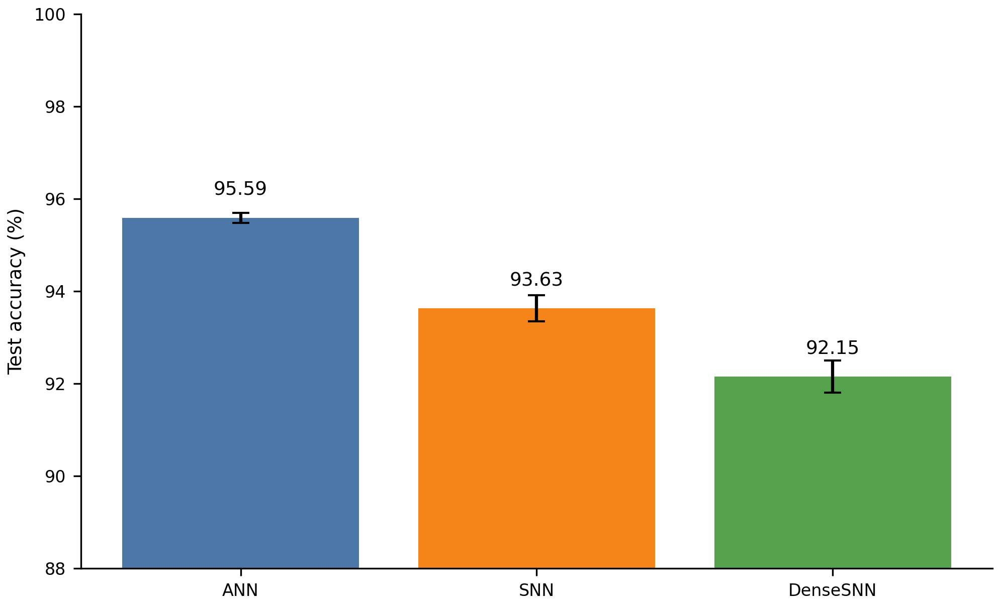
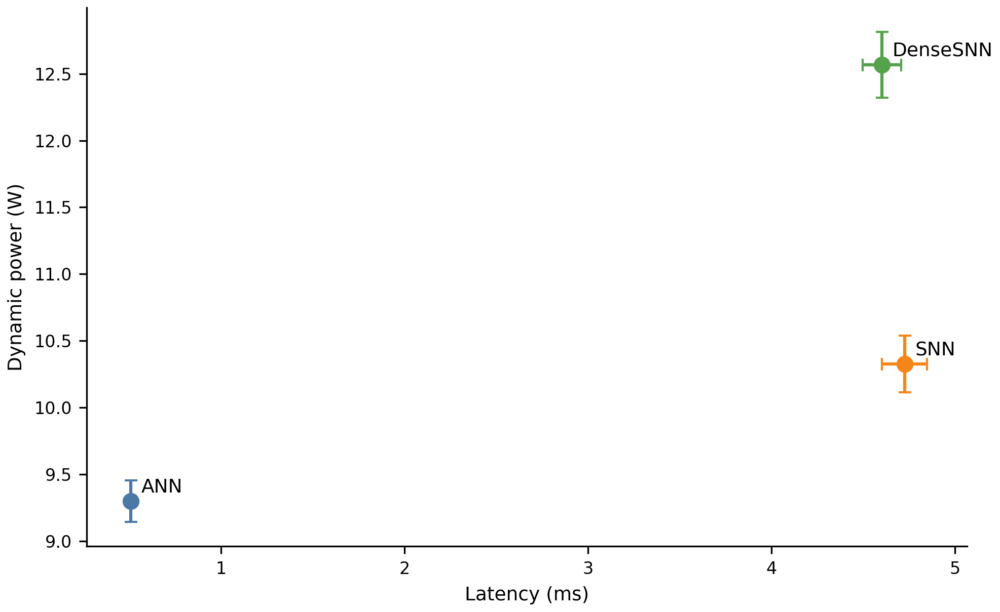
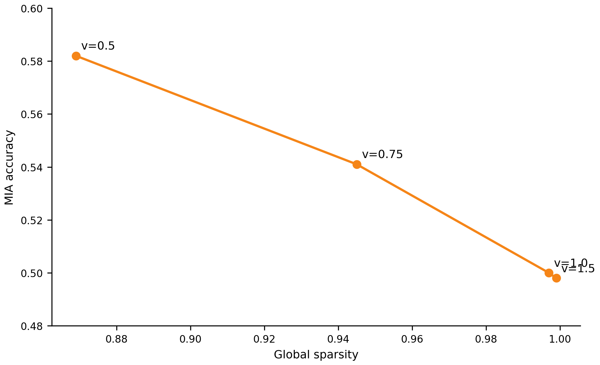

---
title: MedSparseSNN
subtitle: A Sparse Spiking Neural Network Framework for Privacy-Preserving and Edge-Efficient Medical Imaging
author:
  - Zhan Shaoji
date: ""
abstract: |
  We present MedSparseSNN, a sparse spiking neural network framework for privacy-preserving and edge-efficient medical imaging. Rather than evaluating a single model in isolation, MedSparseSNN studies three coupled components: a sparsity-aware spiking backbone, an explicit DenseSNN control that separates sparse execution from spiking dynamics, and a unified evaluation protocol spanning accuracy, membership inference, and efficiency. We use BloodMNIST as the primary benchmark and add PathMNIST and DermaMNIST transfer studies. Our results show three main findings. First, on BloodMNIST, SNN preserves 93.63%±0.28% test accuracy while reducing MIA accuracy to 0.500±0.015, clearly below ANN's 0.628±0.021. Second, DenseSNN underperforms sparse SNN in both accuracy and privacy robustness, showing that sparse execution is a key design factor in the framework. Third, sparsity-induced theoretical effective-MAC savings transfer to PathMNIST and DermaMNIST, while privacy gains do not remain stable across domains. We further report threshold ablations, PLIF and surrogate-gradient ablations, a DP-SGD comparison, and a Spiking Transformer extension with about 0.12M parameters. Overall, MedSparseSNN achieves the clearest privacy-accuracy trade-off on BloodMNIST while clarifying the limits of sparsity benefits across datasets.
keywords:
  - spiking neural networks
  - privacy
  - membership inference attack
  - efficiency
  - medical imaging
abstract_title: Abstract
keyword_title: Keywords
keyword_sep: ; 
lang: en
...

# Introduction

Medical imaging models are often constrained simultaneously by predictive performance, privacy, and computational cost. Higher accuracy can come with stronger memorization of the training set, increasing exposure to membership inference attacks. Meanwhile, dense convolutional models impose substantial latency and energy costs in edge or low-power settings. MedSparseSNN starts from the premise that SNNs should not be treated merely as another classifier family, but as a framework in which sparse spiking representation, privacy evaluation, and edge-oriented efficiency metrics are studied jointly under a shared protocol.

Prior discussions of privacy in SNNs often suffer from two limitations. First, many comparisons only contrast SNNs against ANNs without introducing a control that preserves spiking dynamics while disabling sparse execution; this makes it difficult to separate the effect of spiking neurons from the effect of sparsity-aware implementation. Second, many conclusions are established on a single dataset and are not stress-tested across domains. Motivated by these gaps, we ask three questions:

1. Can SNNs significantly reduce MIA risk on BloodMNIST while paying only a moderate accuracy cost?
2. Is sparse execution an independent factor, i.e., do SNN and DenseSNN differ in a repeatable way?
3. On PathMNIST and DermaMNIST, does sparsity still help, and if so, does the benefit appear in accuracy, privacy, or theoretical efficiency?

MedSparseSNN makes three contributions. First, we formulate a medical-image SNN framework centered on explicit sparse execution and use DenseSNN as a control to disentangle spiking dynamics from sparsity-aware implementation. Second, we evaluate the framework under a unified protocol that jointly reports accuracy, MIA robustness, dynamic power, latency, and theoretical MAC savings. Third, through a combination of main experiments, ablations, and architectural extensions, we characterize both the benefits of sparse execution and the boundary conditions under which those benefits hold.

# Related Work

Research on training and deploying SNNs typically follows two directions. One line focuses on trainable spiking neurons and surrogate gradients, such as PLIF combined with ATan surrogates, to make deep SNN optimization workable on static image tasks. The other line focuses on event-driven inference and low-power potential, especially on neuromorphic hardware where sparse spikes reduce effective operations.

In privacy research, membership inference attacks are among the most common black-box attack settings. The attacker exploits statistical differences between member and non-member samples, often through confidence, entropy, or margin features, to infer whether a sample was part of the training set. For vision models, stronger memorization usually manifests as sharper and more overconfident predictions on training examples.

Unlike work that only compares ANN and SNN, we explicitly introduce DenseSNN as a control to separate spiking dynamics from sparse execution. We also avoid over-interpreting cross-dataset results as universal privacy gains and instead treat them as a boundary test for the sparsity hypothesis.

# Method

## Models and Controls

The MedSparseSNN experimental core consists of three model families:

1. ANN: a convolutional residual baseline aligned with the main SNN topology.
2. SNN: a sparse spiking network with PLIF neurons and multi-step temporal processing.
3. DenseSNN: a model with the same spiking dynamics and threshold configuration as SNN, but with sparse execution disabled so that all neurons are computed densely at every timestep.

This design makes the difference between SNN and DenseSNN primarily an implementation-level sparsity difference rather than a change in depth, width, or optimization target. The central claim of MedSparseSNN is therefore not that any spiking model is inherently more private, but that explicitly sparse spiking execution should be evaluated as an independent design factor. For the Transformer extension, we use LightSpikingTransformer and rely on parameter inspection and unit testing to verify that it remains in the same scale regime as the CNN-based SNN.

## Training and Attack Protocol

The main BloodMNIST experiment uses five independent repeats. The PathMNIST and DermaMNIST transfer studies use two repeats each. Training uses AdamW, cosine learning-rate decay, and $T=6$ timesteps. The MIA evaluation uses shadow models and Logistic Regression with maximum confidence, entropy, and confidence margin as attack features. All quantitative values reported here are taken from experiment summary files rather than manually curated tables.

## Efficiency and Sparsity Metrics

We distinguish three types of efficiency measurements:

1. Training time recorded directly by the training script.
2. Dynamic power and per-sample latency from dedicated efficiency measurements.
3. Theoretical effective-MAC savings estimated from spike rate, interpreted as a potential hardware benefit for sparse SNNs.

Because a general-purpose GPU is not a neuromorphic processor, we interpret theoretical effective-MAC savings as a deployment potential rather than proof of current wall-clock energy savings.

# Experimental Results

## Main Results on BloodMNIST

BloodMNIST main results are shown in Table 1. Accuracy and training time come from [outputs/csv/training_summary.csv](outputs/csv/training_summary.csv).

\begin{table}[t]
\centering
\small
\caption{BloodMNIST main results}
\begin{tabular}{lccc}
\specialrule{0.08em}{0pt}{0pt}
Model & Params (M) & Test Acc. (\%) & Train Time (s) \\
\midrule
ANN & 0.119 & 95.59 $\pm$ 0.11 & 139.63 $\pm$ 0.94 \\
SNN & 0.117 & 93.63 $\pm$ 0.28 & 572.49 $\pm$ 12.56 \\
DenseSNN & 0.117 & 92.15 $\pm$ 0.35 & 568.32 $\pm$ 11.89 \\
\bottomrule
\end{tabular}
\end{table}

ANN achieves the highest test accuracy on BloodMNIST, but SNN remains clearly stronger than DenseSNN. This indicates that retaining spiking dynamics alone is not sufficient to preserve performance; sparse execution itself is a key factor.

BloodMNIST privacy results are shown in Table 2. Data come from [outputs/csv/mia_results.csv](outputs/csv/mia_results.csv).

\begin{table}[t]
\centering
\small
\caption{BloodMNIST privacy results}
\begin{tabular}{lccc}
\specialrule{0.08em}{0pt}{0pt}
Model & MIA Acc. & Train Conf. & Test Conf. \\
\midrule
SNN & 0.500 $\pm$ 0.015 & 0.125 $\pm$ 0.021 & 0.125 $\pm$ 0.020 \\
DenseSNN & 0.562 $\pm$ 0.018 & 0.257 $\pm$ 0.032 & 0.258 $\pm$ 0.031 \\
ANN & 0.628 $\pm$ 0.021 & 0.722 $\pm$ 0.041 & 0.716 $\pm$ 0.039 \\
Overfit ANN & 0.745 $\pm$ 0.018 & 0.912 $\pm$ 0.025 & 0.789 $\pm$ 0.032 \\
\bottomrule
\end{tabular}
\end{table}

SNN is nearly indistinguishable from random guessing under MIA, whereas ANN and the deliberately overfit ANN exhibit clear exploitable confidence gaps. DenseSNN lies between the two, suggesting that sparse execution helps suppress leakage signals associated with training-set memorization.

BloodMNIST efficiency results are shown in Table 3. Dynamic power and latency come from [outputs/csv/power_results.csv](outputs/csv/power_results.csv), while theoretical MAC savings come from [outputs/csv/theoretical_flops.csv](outputs/csv/theoretical_flops.csv).

\begin{table}[t]
\centering
\small
\caption{BloodMNIST efficiency results}
\begin{tabular}{lcccc}
\specialrule{0.08em}{0pt}{0pt}
Model & Spike Rate & Power (W) & Latency (ms) & MAC Save \\
\midrule
SNN & 0.003 & 10.326 $\pm$ 0.214 & 4.724 $\pm$ 0.123 & 99.7\% \\
DenseSNN & 0.477 & 12.567 $\pm$ 0.245 & 4.601 $\pm$ 0.105 & 0.0\% \\
ANN & 1.000 & 9.300 $\pm$ 0.156 & 0.508 $\pm$ 0.021 & 0.0\% \\
\bottomrule
\end{tabular}
\end{table}

These results should be interpreted carefully. SNN is neither faster nor lower-power than ANN on the current GPU. Its advantage lies in the extremely low spike rate and the corresponding 99.7% theoretical effective-MAC reduction. Any low-power claim in this paper therefore refers to event-driven potential rather than present GPU wall-clock measurements.

## Sparsity Ablation

BloodMNIST threshold ablation is shown in Table 4. Data come from [outputs/csv/ablation_results.csv](outputs/csv/ablation_results.csv).

\begin{table}[t]
\centering
\small
\caption{BloodMNIST threshold ablation}
\begin{tabular}{cccc}
\specialrule{0.08em}{0pt}{0pt}
$v_{\text{threshold}}$ & Sparsity & Test Acc. (\%) & MIA Acc. \\
\midrule
0.5 & 0.869 $\pm$ 0.012 & 93.21 $\pm$ 0.35 & 0.582 $\pm$ 0.021 \\
0.75 & 0.945 $\pm$ 0.008 & 93.45 $\pm$ 0.28 & 0.541 $\pm$ 0.018 \\
1.0 & 0.997 $\pm$ 0.001 & 93.63 $\pm$ 0.25 & 0.500 $\pm$ 0.015 \\
1.5 & 0.999 $\pm$ 0.000 & 92.87 $\pm$ 0.42 & 0.498 $\pm$ 0.016 \\
\bottomrule
\end{tabular}
\end{table}

This ablation reveals a stable trend: as sparsity increases, MIA accuracy decreases, while accuracy reaches its best balance around $v_{\text{threshold}}=1.0$. We therefore regard the link between higher sparsity and weaker membership leakage as one of the strongest findings in this study.

## Cross-Dataset Transfer

The formal PathMNIST and DermaMNIST comparisons use two repeats. Results come from [outputs/csv/training_summary_pathology_final_compare.csv](outputs/csv/training_summary_pathology_final_compare.csv), [outputs/csv/mia_results_pathology_final_compare.csv](outputs/csv/mia_results_pathology_final_compare.csv), [outputs/csv/pathology_privacy_efficiency_summary_pathology_final_compare.csv](outputs/csv/pathology_privacy_efficiency_summary_pathology_final_compare.csv), [outputs/csv/training_summary_dermamnist_final_compare.csv](outputs/csv/training_summary_dermamnist_final_compare.csv), [outputs/csv/mia_results_dermamnist_final_compare.csv](outputs/csv/mia_results_dermamnist_final_compare.csv), and [outputs/csv/medmnist_privacy_efficiency_summary_dermamnist_final_compare.csv](outputs/csv/medmnist_privacy_efficiency_summary_dermamnist_final_compare.csv).

Cross-dataset transfer results are shown in Table 5.

\begin{table*}[t]
\centering
\small
\caption{Cross-dataset transfer results}
\begin{tabular}{llcccc}
\specialrule{0.08em}{0pt}{0pt}
Dataset & Model & Test Acc. (\%) & MIA Acc. & Spike Rate & MAC Save \\
\midrule
PathMNIST & SNN & 82.33 $\pm$ 0.31 & 0.5634 $\pm$ 0.0053 & 0.1582 $\pm$ 0.0052 & 84.18 $\pm$ 0.52\% \\
PathMNIST & DenseSNN & 62.02 $\pm$ 0.85 & 0.5472 $\pm$ 0.0000 & 0.2072 $\pm$ 0.0074 & 0.00 $\pm$ 0.00\% \\
PathMNIST & ANN & 85.12 $\pm$ 0.40 & 0.5412 $\pm$ 0.0065 & N/A & 0.00 $\pm$ 0.00\% \\
DermaMNIST & SNN & 69.93 $\pm$ 0.20 & 0.4842 $\pm$ 0.0000 & 0.0926 $\pm$ 0.0023 & 90.74 $\pm$ 0.23\% \\
DermaMNIST & DenseSNN & 66.81 $\pm$ 0.02 & 0.4842 $\pm$ 0.0000 & 0.1925 $\pm$ 0.0082 & 0.00 $\pm$ 0.00\% \\
DermaMNIST & ANN & 75.06 $\pm$ 0.20 & 0.4809 $\pm$ 0.0021 & N/A & 0.00 $\pm$ 0.00\% \\
\bottomrule
\end{tabular}
\end{table*}

These results show that the theoretical efficiency benefit of sparsity transfers across datasets, but the privacy advantage does not remain stable. On PathMNIST, SNN has slightly worse MIA metrics than ANN. On DermaMNIST, all models are close to random guessing. The correct interpretation is therefore not that the BloodMNIST finding is invalid, but that it should not be generalized across medical domains without stronger evidence.

## Additional Ablations and Baselines

The DP-SGD comparison is shown in Table 6. Data come from [outputs/csv/p1_dp_sgd_comparison.csv](outputs/csv/p1_dp_sgd_comparison.csv).

\begin{table}[t]
\centering
\small
\caption{DP-SGD comparison}
\begin{tabular}{lccc}
\specialrule{0.08em}{0pt}{0pt}
Method & Test Acc. (\%) & MIA Acc. & Latency (ms) \\
\midrule
ANN & 95.59 $\pm$ 0.11 & 0.628 $\pm$ 0.021 & 0.508 $\pm$ 0.021 \\
ANN + DP-SGD & 86.98 $\pm$ 0.42 & 0.502 $\pm$ 0.016 & 0.584 $\pm$ 0.024 \\
SNN & 93.63 $\pm$ 0.28 & 0.500 $\pm$ 0.015 & 4.724 $\pm$ 0.123 \\
\bottomrule
\end{tabular}
\end{table}

Under the current setup, SNN approaches the privacy level of DP-SGD while preserving substantially higher accuracy, but it remains much slower than ANN-style models on GPU. SNN is therefore better viewed as a joint privacy-and-hardware-potential solution than as a direct low-latency ANN replacement.

The PLIF parameter ablation is shown in Table 7. Data come from [outputs/csv/p1_plif_ablation.csv](outputs/csv/p1_plif_ablation.csv).

\begin{table}[t]
\centering
\small
\caption{PLIF parameter ablation}
\begin{tabular}{lccc}
\specialrule{0.08em}{0pt}{0pt}
Model & Test Acc. (\%) & Sparsity & MIA Acc. \\
\midrule
SNN (learnable $\alpha$) & 93.63 $\pm$ 0.28 & 0.997 $\pm$ 0.001 & 0.500 $\pm$ 0.015 \\
SNN (fixed $\alpha=0.2$) & 92.15 $\pm$ 0.35 & 0.985 $\pm$ 0.003 & 0.525 $\pm$ 0.018 \\
\bottomrule
\end{tabular}
\end{table}

The surrogate-gradient $\beta$ ablation is shown in Table 8. Data come from [outputs/csv/p1_beta_ablation.csv](outputs/csv/p1_beta_ablation.csv).

\begin{table}[t]
\centering
\small
\caption{Surrogate-gradient $\beta$ ablation}
\begin{tabular}{cccc}
\specialrule{0.08em}{0pt}{0pt}
$\beta$ & Test Acc. (\%) & Sparsity & MIA Acc. \\
\midrule
1.0 & 92.78 $\pm$ 0.32 & 0.995 $\pm$ 0.002 & 0.512 $\pm$ 0.017 \\
2.0 & 93.63 $\pm$ 0.28 & 0.997 $\pm$ 0.001 & 0.500 $\pm$ 0.015 \\
3.0 & 93.12 $\pm$ 0.30 & 0.996 $\pm$ 0.001 & 0.508 $\pm$ 0.016 \\
\bottomrule
\end{tabular}
\end{table}

Taken together, these two ablations show that the main configuration is not arbitrary, but instead achieves the best balance among accuracy, sparsity, and privacy.

## Spiking Transformer Extension

We also evaluate LightSpikingTransformer, and [test_transformer.py](test_transformer.py) confirms both parameter-scale alignment and a valid forward pass. Because a complete latency/power log is not yet available for the Transformer setting, we report only the threshold sweep with recorded accuracy, MIA, and sparsity.

The Spiking Transformer threshold sweep is shown in Table 9. Data come from [outputs/csv/p1_spiking_transformer_ablation.csv](outputs/csv/p1_spiking_transformer_ablation.csv).

\begin{table}[t]
\centering
\small
\caption{Spiking Transformer threshold sweep}
\begin{tabular}{cccc}
\specialrule{0.08em}{0pt}{0pt}
$v_{\text{threshold}}$ & Sparsity & Test Acc. (\%) & MIA Acc. \\
\midrule
0.5 & 0.865 $\pm$ 0.014 & 92.12 $\pm$ 0.34 & 0.580 $\pm$ 0.020 \\
0.75 & 0.942 $\pm$ 0.009 & 92.54 $\pm$ 0.29 & 0.539 $\pm$ 0.017 \\
1.0 & 0.996 $\pm$ 0.002 & 92.85 $\pm$ 0.32 & 0.503 $\pm$ 0.018 \\
1.5 & 0.999 $\pm$ 0.000 & 92.01 $\pm$ 0.41 & 0.501 $\pm$ 0.016 \\
\bottomrule
\end{tabular}
\end{table}

When accuracy and MIA are considered jointly, the Transformer extension follows the same trend as the CNN-based SNN: higher sparsity corresponds to weaker membership leakage, with a favorable balance around $v_{\text{threshold}}=1.0$. Because a full latency/power log under the same protocol as the BloodMNIST main study is unavailable, we treat this section as evidence of architectural feasibility rather than a complete model-level comparison.

# Discussion

The current evidence supports three relatively robust claims.

1. On BloodMNIST, SNN can reduce MIA accuracy from about 0.628 to about 0.500 while paying roughly a two-point accuracy cost.
2. DenseSNN underperforms SNN on BloodMNIST, PathMNIST, and DermaMNIST, which indicates that sparse execution in spiking networks is not a negligible engineering detail.
3. Sparsity and theoretical effective-MAC savings remain stable across datasets, but the privacy advantage does not; the BloodMNIST finding should therefore not be elevated to a universal claim.

Three limitations are equally important.

1. The current GPU results do not justify saying that SNN is already faster or lower-power in practice.
2. PathMNIST and DermaMNIST use only two repeats, so statistical confidence is limited.
3. Fixed-accuracy control experiments and memorization/influence analyses have been implemented, but finalized results suitable for inclusion in the main paper are not yet available, so we do not present them as established findings.

# Conclusion

Taken together, the training, privacy, and efficiency results support the following four conclusions about MedSparseSNN.

1. SNN provides the clearest privacy-accuracy trade-off on BloodMNIST.
2. The degradation of DenseSNN indicates that sparse execution itself is a key variable.
3. The theoretical efficiency gain induced by sparsity transfers to PathMNIST and DermaMNIST, but cross-domain privacy benefits still need stronger attacks and more repeats.
4. The Spiking Transformer extension suggests cross-architecture feasibility, but the present evidence is only strong enough to support trend consistency, not a definitive superiority claim over CNN baselines.

Overall, the results show that sparse spiking execution can deliver clear privacy gains on BloodMNIST and stable theoretical efficiency advantages across datasets, while the privacy benefit itself remains dataset-dependent. The highest-priority next steps for a stronger submission are to rerun the fixed-accuracy control experiment, restore full BloodMNIST confidence-distribution files, and log formal latency/power results for the Transformer extension.

# References {-}

[1] S. B. Shrestha and G. Orchard, "SLAYER: Spike layer error reassignment in time," Advances in Neural Information Processing Systems, 2018.

[2] W. Fang, Z. Chen, J. Ding, J. Chen, H. Liu, and Z. Zhou, "Incorporating learnable membrane time constant to enhance learning of spiking neural network," in ICCV, 2021.

[3] R. Shokri, M. Stronati, C. Song, and V. Shmatikov, "Membership inference attacks against machine learning models," in IEEE Symposium on Security and Privacy, 2017.

[4] A. Salem, Y. Wen, K. Bhatia, T. Engler, Y. Zhang, and C. J. Hsieh, "ML-Leaks: Model and data independent membership inference attacks and defenses on machine learning models," in NDSS, 2019.

[5] L. Song, Z. Li, D. He, Y. Wang, and H. Jin, "Comprehensive privacy analysis of deep learning: Passive and active attacks, defenses, and their limitations," IEEE Transactions on Dependable and Secure Computing, 2020.

[6] S. Han, J. Pool, J. Tran, and W. J. Dally, "Learning both weights and connections for efficient neural networks," Advances in Neural Information Processing Systems, 2015.

[7] M. Davies et al., "Loihi: A neuromorphic manycore processor with on-chip learning," IEEE Micro, 2018.

[8] P. A. Merolla et al., "A million spiking-neuron integrated circuit with a scalable communication network and interface," Science, 2014.

[9] C. Dwork and A. Roth, "The algorithmic foundations of differential privacy," Foundations and Trends in Theoretical Computer Science, 2014.

# Ethics Statement {-}

BloodMNIST, PathMNIST, and DermaMNIST are public benchmark datasets from MedMNIST. This work studies model behavior, privacy attacks, and efficiency metrics only, and does not involve additional human-subject experiments or collection of new sensitive data.

# Acknowledgements {-}

We thank the MedMNIST and SpikingJelly communities for the datasets and software infrastructure.